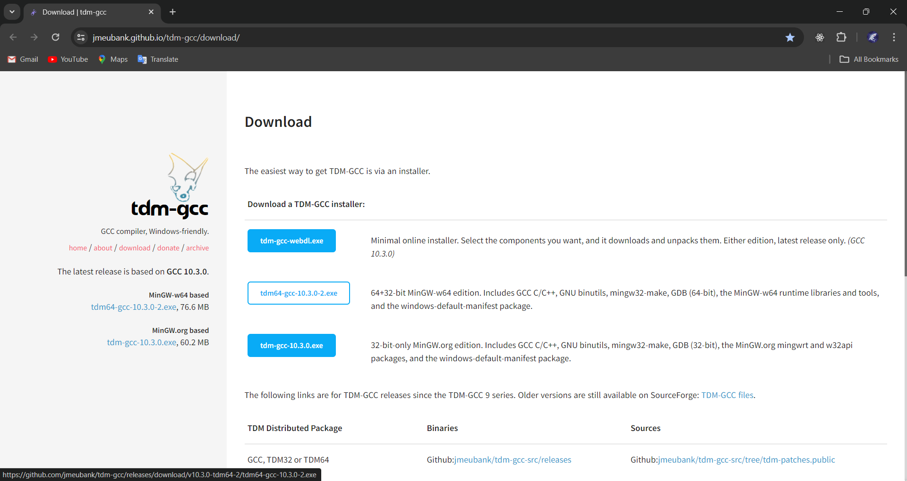
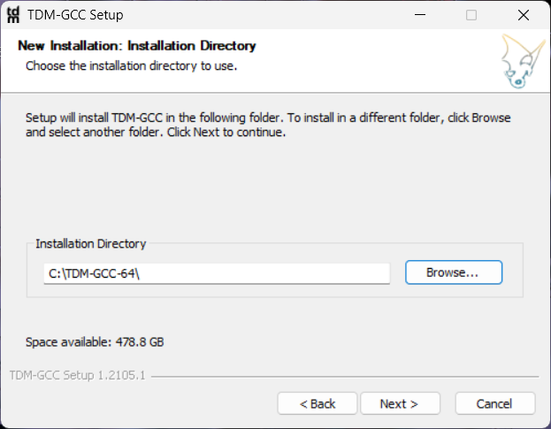
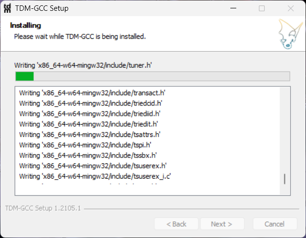
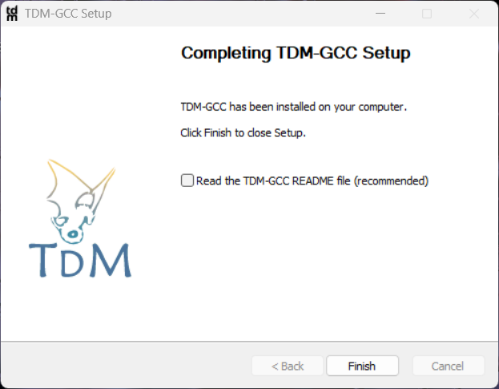
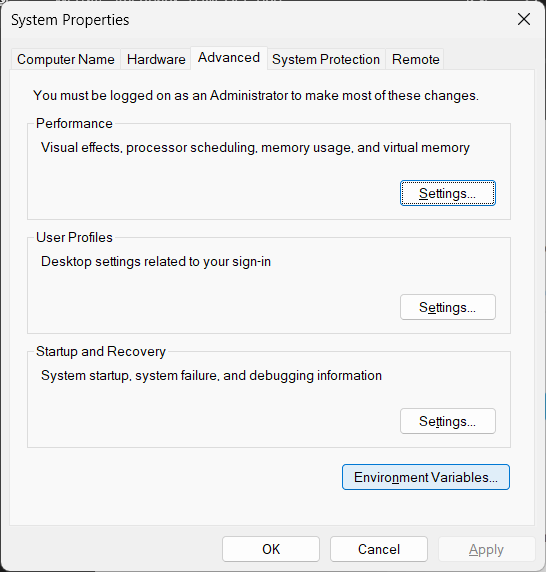
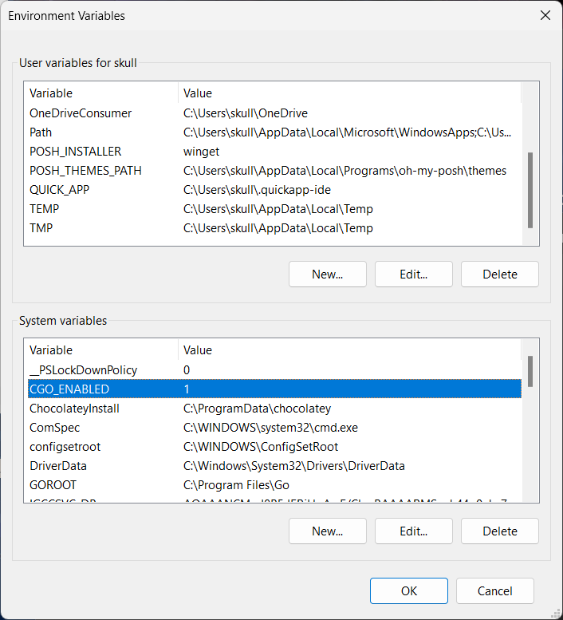
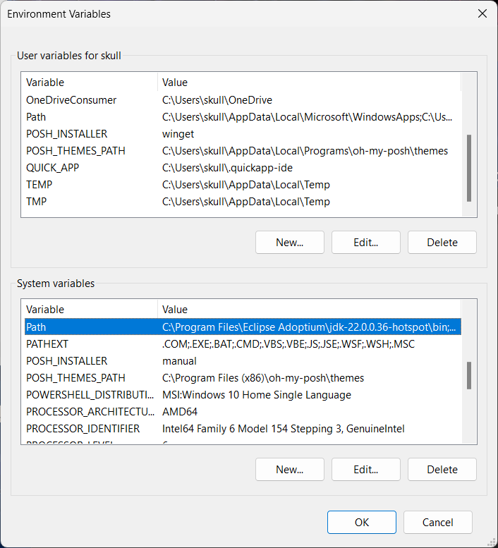
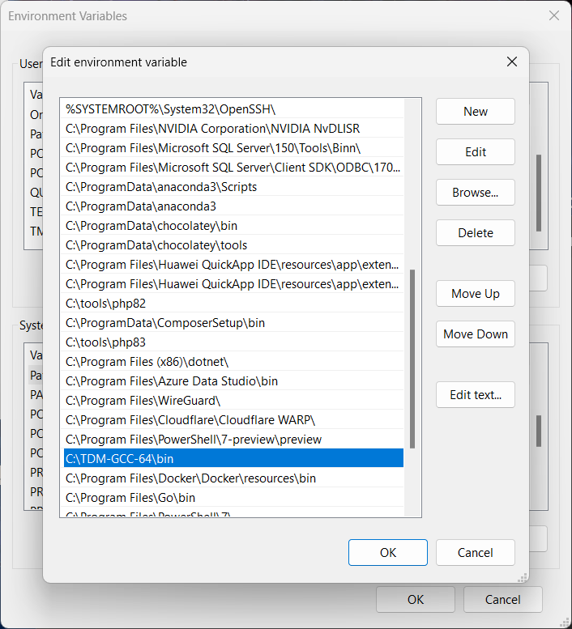

## Windows Requirments Installed

- TDM-GCC (github.com/mattn/go-sqlite3)
  - website: [https://jmeubank.github.io/tdm-gcc/download/](https://jmeubank.github.io/tdm-gcc/download/)
  - win64-exe: [tdm64-gcc-10.3.0-2.exe](https://github.com/jmeubank/tdm-gcc/releases/download/v10.3.0-tdm64-2/tdm64-gcc-10.3.0-2.exe)
  - win32-exe: [tdm-gcc-10.3.0.exe](https://github.com/jmeubank/tdm-gcc/releases/download/v10.3.0-tdm-1/tdm-gcc-10.3.0.exe)

